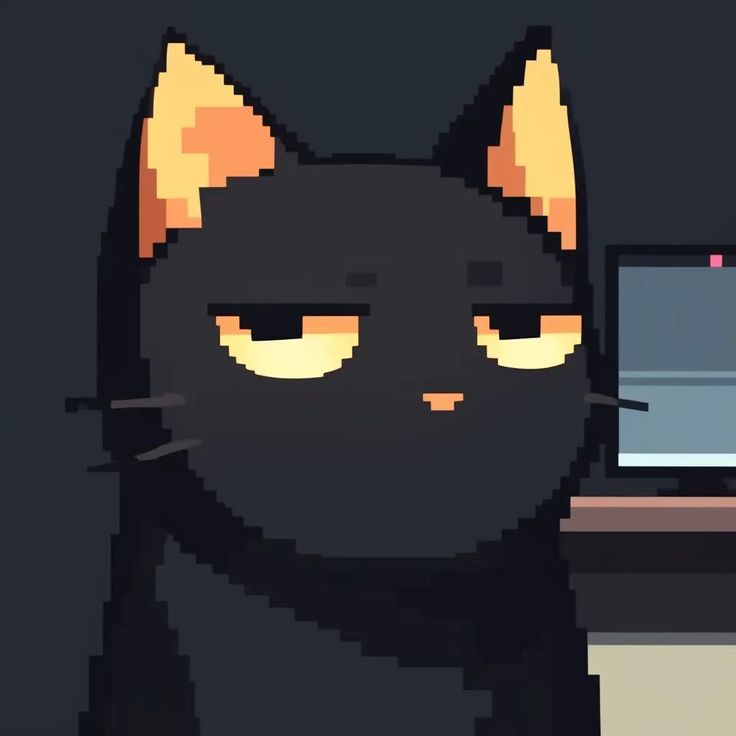

<!-- Üst Dalga Banner (GitHub profilinizin en üstünde görsel bir çerçeve oluşturur) -->

<h1 align="center">Özlem AKINCI</h1>  

**Computer Engineer | AI & Machine Learning | IoT & Embedded Systems**  
📍 Bursa, Turkey

 

<!-- Piksel Karakter & ASCII / Yazı Karşılama Kutusu -->
<table>
  <table border="0">
    <tr>
      <!-- Sol: cat.jpg -->
      <td align="center" valign="middle" width="120">
        
      </td>
      <!-- Sağ: Koyu Arka Planlı ASCII Hello World Kutusu -->
      <td align="center" valign="middle">
        <pre><code>
  |   |     | |       \  \ /  /       |    | |
  |---| .-. | | .-.    \  \  /.-. .--.| .-.| |
  |   |(.-' | |(   )    \/ \/(   )|   |(   | '
     '   ' `--'`-`-`-'      ' '  `-' '   `-`-'`-o-o </code></pre>
      </td>
    </tr>
  </table>

<!-- Neon Pembe Terminal Karşılama Satırı -->
<!-- Sırayla Yazan Terminal Karşılama Yazısı -->
  

    
  

<!--
**Zlmknc/Zlmknc** is a ✨ _special_ ✨ repository because its `README.md` (this file) appears on your GitHub profile.

Here are some ideas to get you started:

- 🔭 I’m currently working on ...
- 🌱 I’m currently learning ...
- 👯 I’m looking to collaborate on ...
- 🤔 I’m looking for help with ...
- 💬 Ask me about ...
- 📫 How to reach me: ...
- 😄 Pronouns: ...
- ⚡ Fun fact: ...
-->

---

### 🔭 Şu An Üzerinde Çalıştığım
Yerel AI Agent — Kişisel & Güvenli  
periodic-genes-S  
forest-thinning-yolov11

---

`Python` • `YOLOv11` • `Scikit-learn` • `Raspberry Pi` • `RFID` • `Pandas` • `Git`[cite: 1]

  

### 📊 Aktivite

<!-- Aktiflik / Streak Kartı İsterseniz -->

  

  

📫 zlmakinci73@gmail.com · [LinkedIn](https://www.linkedin.com/in/ozlem-akinci) · Bursa, Türkiye  

  
˙ᵕ˙ ༘˚⋆𐙚｡ ° 𖦹. ˚

  
ᓚᘏᗢ ࣪˖ ִֶָ <em>"keep moving forward..."</em> ִֶָ ࣪˖ 🐾

<!-- Alt Dalga Banner -->

